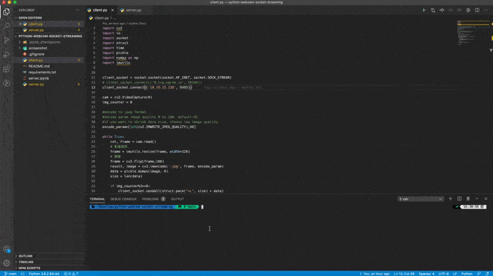
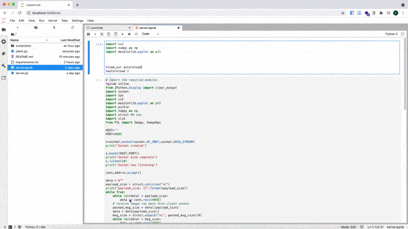
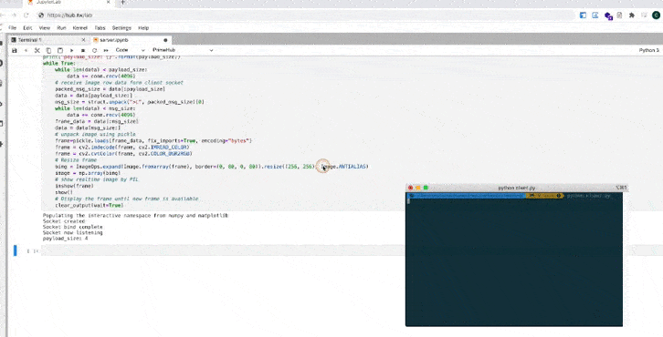

# python-webcam-socket-streaming
Python OpenCV webcam sending frames through TCP socket. 

## YouTube Tutorial
[](https://www.youtube.com/watch?v=MQ8JfdvA7Yk)

## What is a network Socket?
- A software structure within a network node
- Serves as an endpoint to send & receive
- A combination of protocpl type, IP address and Port number for data communication

## Implementation of Sockets
In standard interent protocols like TCP and UDP, socket address is the combination of:

```
socket address = (IP address, port number)
```

## How to find IP address?
Depending on the operating system, you can easily find the IP address of your machine. Go to the terminal window and run this command:
#### macOS

```
ipconfig getifaddr en0
```
#### Windows/Linux/Ubuntu

```
ifconfig
```

> For Windows users. The required IP address will show against IPv4 Address.

> For Linux and Ubuntu users. The required IP address will be for Wifi LAN (inet).

## client-server model
- Server creates socket on startup
- May serve several  clients concurrently
- A client should know the server IP and port


## Python Server module


## Python Client module


## Video data transmission
### At server side
- With OpenCV get video frames of webcam
- With pickle serialize frame to byte data
- Pack each frame data using struct module
- Send data to client and display frame

### At client side
- Receive packets and append them to data
- Unpack the data using struct module
- Load the frame using pickle
- Display the frame at client side

## Getting Started
### Clone Project
you can create a new project based on this repo by doing the following:

```
git clone https://github.com/1010code/python-webcam-socket-streaming.git
```

### Installation
When that's done, install the project dependencies.

```
pip install -r requirements.txt
```

#### Run server
open terminal and execute `server.py`. And we'll create TCP socket and listening 8485 port.

```
python server.py
```

### Run client
After running the `server.py`, copy paste the IP and PORT to `client.py`. After doing that, then start client.

```
python client.py
```

## Demo
- PC 1: run server.py
- PC 1: run client.py




- PC 1: run server.ipynb
- PC 1: run client.py



- PC 1: run server.ipynb
- PC 2: run client.py



## Reference
- [kittinan/socket](https://gist.github.com/kittinan/e7ecefddda5616eab2765fdb2affed1b)
- [Socket programming and OpenCv in Python](https://www.youtube.com/watch?v=7-O7yeO3hNQ)